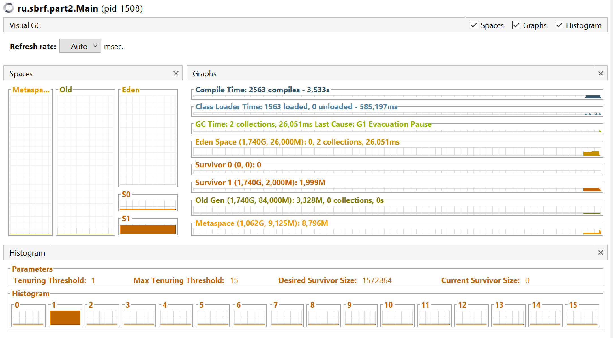
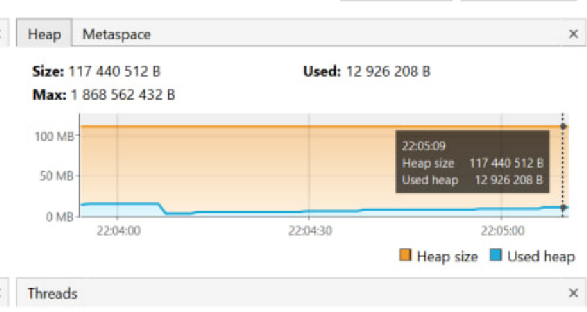

= Часть 1: -XX:+PrintCompilation

Output:
----
     99    1       3       java.lang.Object::<init> (1 bytes)
     99    2       3       jdk.internal.util.ArraysSupport::signedHashCode (37 bytes)
    102    3       3       java.lang.String::charAt (25 bytes)
    103    4       3       java.lang.String::checkIndex (10 bytes)
    103    5       3       java.lang.String::isLatin1 (19 bytes)
    104    6       3       java.lang.String::hashCode (60 bytes)
    106    7       3       java.lang.StringLatin1::hashCode (52 bytes)
    106    8       3       jdk.internal.util.ArraysSupport::vectorizedHashCode (158 bytes)
    107   10       3       java.util.ImmutableCollections$SetN::probe (56 bytes)
    108    9       3       java.lang.Math::floorMod (20 bytes)
    ... (полностью см. в файле part1.adoc)  ...
    368  233       4       java.lang.String::valueOf (5 bytes)
    372  222       3       java.lang.Integer::toString (55 bytes)   made not entrant
    375  236     n 0       java.lang.invoke.MethodHandle::linkToStatic(LLIL)I (native)   (static)
    376  237       3       java.lang.ref.Reference::<init> (25 bytes)
    376  238     n 0       java.lang.invoke.MethodHandle::linkToStatic(LLLLL)I (native)   (static)
    377  239 %     3       ru.sbrf.part1.Main::main @ 10 (38 bytes)
    378  240       3       ru.sbrf.part1.Main::main (38 bytes)
    384  225       3       java.lang.String::valueOf (5 bytes)   made not entrant
----

Первая колонка показывает миллисекунды с момента запуска виртуальной машины.

Далее идет последовательность выполнения кода/методов.

В третьей колонке опциональное наличие s означает синхронизированный метод, n - локальный, % - метод скомпилирован локально и хранится в памяти в code cache.

В четвертой колонке число от 0 до 4 обозначает тип компиляции: 0 - без компиляции, от 1 до 4 - более глубокие уровни.

== Часть 2: -XX:+PrintCompilation -XX:+UnlockDiagnosticVMOptions -XX:+PrintInlining

Output:
----
    134    1       3       java.lang.Object::<init> (1 bytes)
    135    2       3       java.lang.String::charAt (25 bytes)
                              @ 1   java.lang.String::isLatin1 (19 bytes)   inline
                              @ 12   java.lang.StringLatin1::charAt (15 bytes)   inline
                                @ 3   java.lang.String::checkIndex (10 bytes)   inline
                                  @ 5   jdk.internal.util.Preconditions::checkIndex (18 bytes)   intrinsic
                              @ 21   java.lang.StringUTF16::charAt (11 bytes)   inline
                                @ 2   java.lang.StringUTF16::checkIndex (9 bytes)   inline
                                  @ 2   java.lang.StringUTF16::length (5 bytes)   inline
                                  @ 5   java.lang.String::checkIndex (10 bytes)   inline
                                    @ 5   jdk.internal.util.Preconditions::checkIndex (18 bytes)   intrinsic
                                @ 7   java.lang.StringUTF16::getChar (60 bytes)   intrinsic
    136    4       3       java.lang.String::isLatin1 (19 bytes)
    136    3       3       java.lang.String::checkIndex (10 bytes)
                              @ 5   jdk.internal.util.Preconditions::checkIndex (18 bytes)   intrinsic
    ... (полностью см. в файле part2.adoc)
----

-XX:+UnlockDiagnosticVMOptions используется для тестирования, отладки и сбора детальной информации.

-XX:+PrintInlining включается вместе с UnlockDiagnosticVMOptions и необходима для вывода в логи информации о компиляции кода, декомпиляции и оптимизациях.

Можем видеть следующие категории методов:

1. inline (hot) – метод помечен горячим и заинлайнен;
2. too big – не горячий, не заинлайнен, так как слишком большой размер сгенеренного байткода;
3. hot method too big – горячий, не заинлайнен, так как слишком большой размер сгенеренного байткода

== GC

Запущен jvisualvm, установлен Visual GC

А на скриншоте ниже можно увидеть изменение heap size

